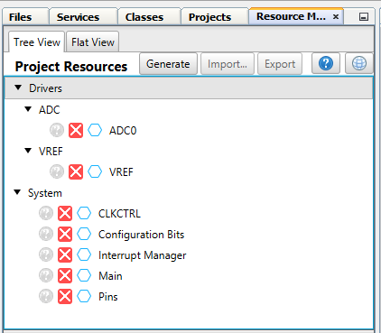
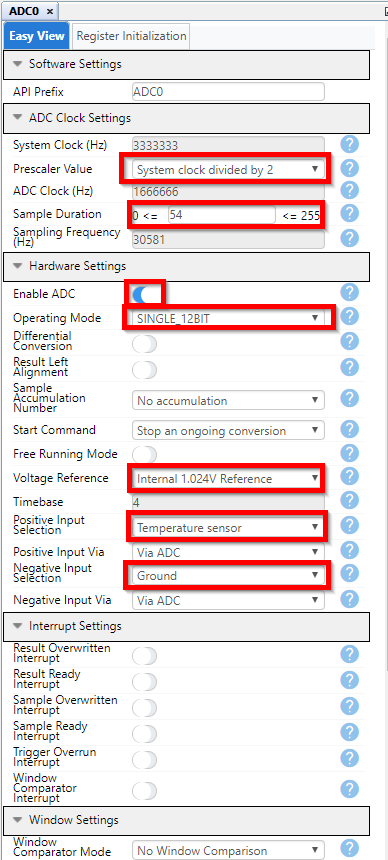
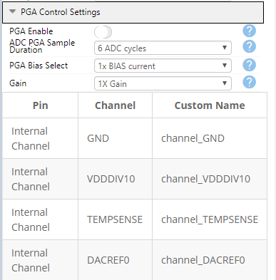
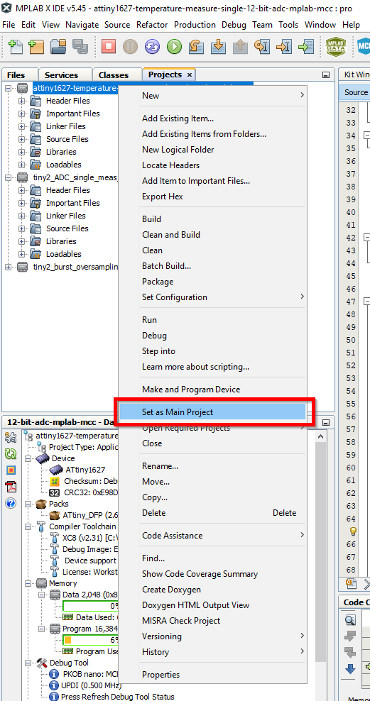
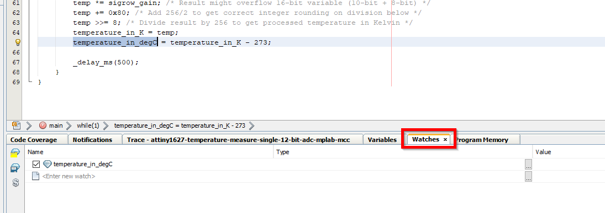
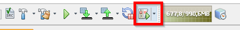
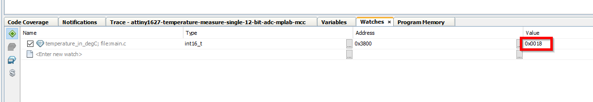

<!-- Please do not change this logo with link -->

# Measuring the Internal Temperature Sensor using the 12-bit ADC in Single Mode

This code example shows how to use the ADC on tinyAVR® 2 Family microcontrollers to measure the internal temperature sensor. In Single mode, when the ADC conversion is triggered, the ADC result is available for a single sample. In this mode, ADC resolution can be selected to be 8-bit or 12-bit. In this example, the ADC is used in Single mode to measure the internal temeperature sensor with 12-bit resolution.

## Related Documentation

- [TB3256 - How to Use the 12-Bit Differential ADC with PGA in Single Mode](https://microchip.com/DS90003256)
- [ATtiny1627 device page](https://www.microchip.com/wwwproducts/en/ATTINY1627)

## Software Used

Microchip’s free MPLAB X IDE, compiler and MPLAB Code Configurator (MCC) graphical code generator are used throughout the application firmware development to provide easy and hassle-free user experience. Following are the tool versions used for this example:

* [MPLAB® X IDE v5.45](https://www.microchip.com/mplab/mplab-x-ide) or newer
* [XC8 Compiler v2.31](https://www.microchip.com/mplab/compilers) or newer
* [MPLAB® Code Configurator (MCC) v4.1.0](https://www.microchip.com/mplab/mplab-code-configurator) or newer
* [MPLAB® Melody Library 1.37.17 or newer](https://www.microchip.com/mplab/mplab-code-configurator) or newer
* [MCC Device Libraries 8-bit AVR MCUs 2.7.0](https://www.microchip.com/mplab/mplab-code-configurator) or newer
* [Microchip ATtiny1627 Device Support 2.6.122 or newer](https://packs.download.microchip.com/) or newer

## Hardware Used

- ATtiny1627 Curiosity Nano [(DM080104)](https://www.microchip.com/developmenttools/ProductDetails/DM080104)

## Peripherals Configuration using MCC

### Added Peripherals

### ADC Configuration

## Setup

- Connect the ATtiny1627 Curiosity Nano to a computer using USB cable 
- Download and install all software components as listed under 'Software Used'

## Operation

- Download the zip file or clone the example to get the source code
- Open the .X file with the MPLAB® X IDE
- Set the *attiny1627-temperature-measure-single-12-bit-adc-mplab-mcc* project as Main project by right-clicking on the project title

	

- Program the project to the ATtiny1627 Curiosity Nano: 

	- First clean and build the project by pressing the *Clean and Build Main Project* button

		

	- Then make and progam the project to the ATtiny1627 by clicking the *Make and Program Device Main Project* button
	
		
	
- To verify that the code is working:

	- Add a Watch to the **temperature_in_degC** variable found in *main.c*

		

			
	   
 
	
	- Select the *Watches* tab

		

			
	   
 
	
	- Run code in debugging mode by clicking the *Debug Main Project* button
	
		
	
	- Pause the debug session by clicking the *Pause* button
	
		
	
	- Now you can read out the latest measurement in the *Watches* tab. Notice that the readout value is in hex format, so remember to convert to decimal value (0x0018 = 24).
	
		

			
	   
 
		<!--  -->

## Summary

This example shows how to use the ADC in single mode to get a 12-bit resolution measurement of the internal temperature sensor on an tinyAVR® 2-series device.